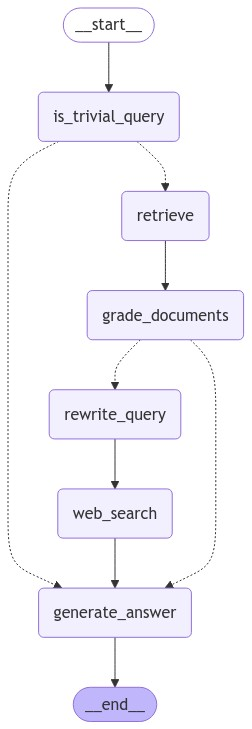

# Agentic RAG App

## Overview

This repository contains a Retrieval-Augmented Generation (RAG) application that serves as an intelligent question-answering system. The app provides two modes of operation:
- **Basic RAG**: A simpler retrieval-based question-answering service.
- **Agentic RAG**: A more advanced version that uses an agent-based system to enhance the quality of responses. Agent has the capability to search the web incase of context-irrelevant queries.

The app uses:
- **FastAPI**: For creating REST API endpoints.
- **Gradio**: For providing a user-friendly chat interface.
- **Pinecone**: For document embedding and vector store retrieval.
- **GPT-4o**: As the language model for generating answers based on retrieved documents.
- **Pydub**: For text-to-speech audio playback.

## Features

- **Text-to-speech**: The app generates speech for the answers using the Sarvam API.
- **RAG Pipeline**: Combines document retrieval with state-of-the-art language models.
- **Two modes**: `basic` and `agentic`, accessible through API endpoints or a Gradio interface.


## Agentic RAG System Workflow

The following image illustrates the workflow of the Agentic RAG System:




## Requirements

- Python 3.9+
- Docker
- [Pinecone API Key](https://www.pinecone.io/)
- [Sarvam Text-to-Speech API Key](https://sarvam.ai/)


## Document Indexer

The repository also includes a document indexing utility that allows you to index PDF documents into a Pinecone vector store using LangChain. This tool splits PDF files into smaller chunks, generates embeddings for the chunks, and stores them in the Pinecone index.

### How It Works

The `index_document()` function takes the path to a PDF document, processes it by splitting it into smaller chunks, and then generates embeddings using a pre-configured model. These embeddings are stored in a Pinecone index.

### Usage
```bash
python indexer/document_indexer.py --filepath path/to/your/document.pdf
```

## Installation

### Using Docker

1. Clone the repository:
   ```bash
   git clone https://github.com/Vinay-Puthalath/agentic-rag-pdf.git
   cd agentic-rag-pdf
   ```

2. Create a `.env` file and add the following variables:
   ```bash
   UVICORN_HOST=0.0.0.0
   UVICORN_PORT=7860
   EMB_MODEL_NAME=your_model_name
   PINECONE_API_KEY=your_pinecone_api_key
   PINECONE_INDEX_NAME=your_index_name
   PINECONE_NAMESPACE=your_namespace
   SARVAM_API_KEY=your_sarvam_api_key
   ```

3. Build and run the application with Docker Compose:
   ```bash
   docker-compose up --build
   ```

4. Access the app:
   - **Gradio Interface**: [http://localhost:7850/rag/basic][http://localhost:7860/rag/agentic]
     - Basic RAG: `7850`
     - Agentic RAG: `7860`
   - **API Endpoints**:
     - Basic RAG: `/rag/basic`
     - Agentic RAG: `/rag/agentic`


### Without Docker

1. Install the dependencies:
   ```bash
   pip install -r requirements.txt
   ```

2. Start the application:
   ```bash
   python main.py --type basic  # Or --type agentic for the advanced version
   ```

### Audio Playback

The application also includes text-to-speech capabilities. The generated response will be played as audio if running outside of Docker.

